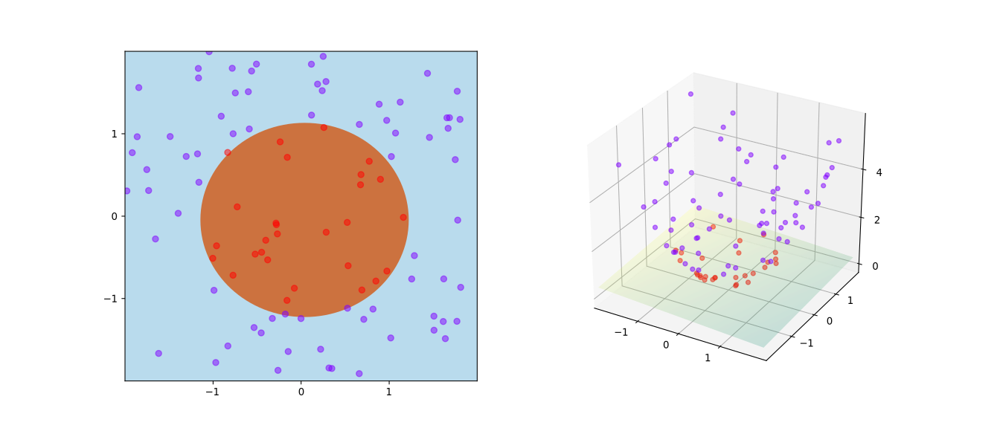

## **<u>L6. cont.</u>**

# ***Part V. Support Vector Machines***

- SVMs are among the best (and many believe are indeed the best) “off-the-shelf” supervised learning algorithm.

### Notation

- We'll use $y \in\{-1,1\}$ (instead of $\{0,1\}$ ) to denote the class labels. Also, rather than parameterizing our linear classifier with the vector $\theta$, we will use parameters $w, b$, and write our classifier as
  $$
  h_{w, b}(x)=g\left(w^{T} x+b\right) .
  $$
  Here, $g(z)=1$ if $z \geq 0$, and $g(z)=-1$ otherwise.

## **Functional and geometric margins**

- Given a training example $\left(x^{(i)}, y^{(i)}\right)$, we define the **functional margin** of $(w, b)$ with respect to the training example
  $$
  \hat{\gamma}^{(i)}=y^{(i)}\left(w^{T} x+b\right)
  $$

  - a large functional margin represents a confident and a correct prediction.

  - Given a training set $S=\left\{\left(x^{(i)}, y^{(i)}\right) ; i=1, \ldots, m\right\}$, we define the functional margin
    $$
    \hat{\gamma}=\min _{i=1, \ldots, m} \hat{\gamma}^{(i)}
    $$

- Next, let's talk about **geometric margins**. Note that $w$ is orthogonal to the separating hyperplane. And $w /\|w\|$ is a unit-length vector pointing in the same direction as $w$. All points $x$ on the decision boundary satisfy the equation $w^{T} x+b=0$. Hence (a positive training example),
  $$
  w^{T}\left(x^{(i)}-\gamma^{(i)} \frac{w}{\|w\|}\right)+b=0
  $$

  - Solving for $\gamma^{(i)}$ yields

  $$
  \gamma^{(i)}=\frac{w^{T} x^{(i)}+b}{\|w\|}=\left(\frac{w}{\|w\|}\right)^{T} x^{(i)}+\frac{b}{\|w\|} .
  $$

  - More generally, we define the geometric margin of $(w, b)$ with respect to a training example $\left(x^{(i)}, y^{(i)}\right)$ to be
    $$
    \gamma^{(i)}=y^{(i)}\left(\left(\frac{w}{\|w\|}\right)^{T} x^{(i)}+\frac{b}{\|w\|}\right) .
    $$

    - Note that if $\|w\|=1$, then the functional margin equals the geometric margin - this thus gives us a way of relating these two different notions of margin. 
    - Also, the geometric margin is invariant to rescaling of the parameters.

  - Finally, given a training set $S=\left\{\left(x^{(i)}, y^{(i)}\right) ; i=1, \ldots, m\right\}$, we define the functional margin
    $$
    \gamma=\min _{i=1, \ldots, m} \gamma^{(i)} .
    $$

## **The optimal margin classifier**

- Given a training set, it seems from our previous discussion that a natural desideratum is to try to find a decision boundary that maximizes the (geometric) margin.

- We can pose the following optimization problem:
  $$
  \begin{array}{rl}
  \max _{\gamma, w, b} &\gamma\\
  \text { s.t. } & y^{(i)}\left(w^{T} x^{(i)}+b\right) \geq \gamma, \quad i=1, \ldots, m \\
  & \|w\|=1
  \end{array}
  $$

  - The $\|w\|=1$ constraint moreover ensures that the functional margin equals to the geometric margin, 
  - so we are also guaranteed that all the geometric margins are at least $\gamma$.

- However, the ""$\|w\|=1$"" constraint is a nasty (<u>*non-convex*</u>) one

- We will introduce the scaling constraint that the functional margin of $w, b$ with respect to the training set must be 1 :
  $$
  \hat{\gamma}=1 .
  $$

- Noting that maximizing $\hat{\gamma} /\|w\|=1 /\|w\|$ is the same thing as minimizing $\|w\|^{2}$, we now have the following optimization problem:
  $$
  \begin{array}{rl}
  \min _{\gamma, w, b} &\frac{1}{2}\|w\|^{2} \\
  \text {s.t.} &y^{(i)}\left(w^{T} x^{(i)}+b\right) \geq 1, \quad i=1, \ldots, m
  \end{array}
  $$

  - The above is an optimization problem with a <u>*convex*</u> quadratic objective and only linear constraints. 
  - Its solution gives us the **optimal margin classifier**. 
  - This optimization problem can be solved using commercial <u>*quadratic programming (QP)*</u> code.

## **<u>L7. Support Vector Machines. Kernels.</u>**

### Lagrange duality

- see Notes3 for detail

### Optimal margin classifiers

- Using Lagrange duality (see Notes3 for detail), we obtain the following dual optimization problem:
  $$
  \begin{aligned}
  \max _{\alpha} & W(\alpha)=\sum_{i=1}^{m} \alpha_{i}-\frac{1}{2} \sum_{i, j=1}^{m} y^{(i)} y^{(j)} \alpha_{i} \alpha_{j}\left\langle x^{(i)}, x^{(j)}\right\rangle . \\
  \text { s.t. } & \alpha_{i} \geq 0, \quad i=1, \ldots, m \\
  & \sum_{i=1}^{m} \alpha_{i} y^{(i)}=0
  \end{aligned}
  $$

- In order to make a prediction, we have to calculate a quantity that depends only on the inner product between $x$ and the points in the training set. 
  $$
  \begin{aligned}
  w^{T} x+b &=\left(\sum_{i=1}^{m} \alpha_{i} y^{(i)} x^{(i)}\right)^{T} x+b \\
  &=\sum_{i=1}^{m} \alpha_{i} y^{(i)}\left\langle x^{(i)}, x\right\rangle+b
  \end{aligned}
  $$

  - Moreover, we saw earlier that the $\alpha_{i}$ 's will all be zero except for the support vectors. Thus, many of the terms in the sum above will be zero, and we really need to find only the inner products between $x$ and the support vectors.

- By examining the dual form of the optimization problem, we were able to write the entire algorithm in terms of only <u>*inner products between input feature vectors*</u>.

## **Kernels**

- Featuer Mapping

  - We'll call the "original" input value the input **attributes** of a problem

  - When that is mapped to some new set of quantities that are then passed to the learning algorithm, we'll call those new quantities the input **features**. 

  - We will also let $\phi$​ denote the **feature mapping**, which maps from the attributes to the features. For instance,
    $$
    \phi(x)=\left[\begin{array}{c}
    x \\
    x^{2} \\
    x^{3}
    \end{array}\right] .
    $$

  - Since the algorithm can be written entirely in terms of the inner products $\langle x, z\rangle$, this means that we would <u>*replace all those inner products with $\langle\phi(x), \phi(z)\rangle$*</u>. Specificically, given a feature mapping $\phi$, we define the corresponding **Kernel** to be
    $$
    K(x, z)=\phi(x)^{T} \phi(z) .
    $$

- Let’s see an example.

  - Suppose $x, z \in \mathbb{R}^{n}$, and consider
    $$
    K(x, z)=\left(x^{T} z\right)^{2} .
    $$

  - We can also write this as
    $$
    \begin{aligned}
    K(x, z) &=\left(\sum_{i=1}^{n} x_{i} z_{i}\right)\left(\sum_{j=1}^{n} x_{i} z_{i}\right) \\
    &=\sum_{i=1}^{n} \sum_{j=1}^{n} x_{i} x_{j} z_{i} z_{j} \\
    &=\sum_{i, j=1}^{n}\left(x_{i} x_{j}\right)\left(z_{i} z_{j}\right)
    \end{aligned}
    $$

  - Thus, we see that $K(x, z)=\phi(x)^{T} \phi(z)$, where the feature mapping $\phi$ is given (shown here for the case of $n=3$ ) by
    $$
    \phi(x)=\left[\begin{array}{c}
    x_{1} x_{1} \\
    x_{1} x_{2} \\
    x_{1} x_{3} \\
    x_{2} x_{1} \\
    x_{2} x_{2} \\
    x_{2} x_{3} \\
    x_{3} x_{1} \\
    x_{3} x_{2} \\
    x_{3} x_{3}
    \end{array}\right] .
    $$

  - Note that <u>*whereas calculating the high-dimensional $\phi(x)$ requires $O\left(n^{2}\right)$ time, finding $K(x, z)$ takes only $O(n)$ time*</u> - linear in the dimension of the input attributes.

- Now, let's talk about a slightly different view of kernels.

  - if $\phi(x)$ and $\phi(z)$ are close together, then we might expect $K(x, z)=\phi(x)^{T} \phi(z)$ to be large. Conversely, if $\phi(x)$ and $\phi(z)$ are far apart-say nearly orthogonal to each other-then $K(x, z)=\phi(x)^{T} \phi(z)$ will be small. So, we can think of $K(x, z)$ as <u>*some measurement of how similar are $\phi(x)$ and $\phi(z)$,*</u> or of how similar are $x$ and $z$.

  - For instance, perhaps you chose
    $$
    K(x, z)=\exp \left(-\frac{\|x-z\|^{2}}{2 \sigma^{2}}\right)
    $$

  - Can we use this definition of $K$ as the kernel in an SVM? 
    (In this particular example, the answer is yes. This kernel is called the **Gaussian kernel**, and corresponds to an infinite dimensional feature mapping $\phi$.)

- Consider some finite set of $m$ points (not necessarily the training set) $\left\{x^{(1)}, \ldots, x^{(m)}\right\}$, and let a square, $m$-by- $m$ matrix $K$ be defined so that its $(i, j)$-entry is given by $K_{i j}=K\left(x^{(i)}, x^{(j)}\right)$. This matrix is called the **Kernel matrix**.

  - Now, if $K$ is a valid Kernel, then $K_{i j}=K\left(x^{(i)}, x^{(j)}\right)=\phi\left(x^{(i)}\right)^{T} \phi\left(x^{(j)}\right)=$ $\phi\left(x^{(j)}\right)^{T} \phi\left(x^{(i)}\right)=K\left(x^{(j)}, x^{(i)}\right)=K_{j i}$, and hence $K$ must be symmetric. Moreover, letting $\phi_{k}(x)$ denote the $k$-th coordinate of the vector $\phi(x)$, we find that for any vector $z$, we have
    $$
    \begin{aligned}
    z^{T} K z &=\sum_{i} \sum_{j} z_{i} K_{i j} z_{j} \\
    &=\sum_{i} \sum_{j} z_{i} \phi\left(x^{(i)}\right)^{T} \phi\left(x^{(j)}\right) z_{j} \\
    &=\sum_{i} \sum_{j} z_{i} \sum_{k} \phi_{k}\left(x^{(i)}\right) \phi_{k}\left(x^{(j)}\right) z_{j} \\
    &=\sum_{k} \sum_{i} \sum_{j} z_{i} \phi_{k}\left(x^{(i)}\right) \phi_{k}\left(x^{(j)}\right) z_{j} \\
    &=\sum_{k}\left(\sum_{i} z_{i} \phi_{k}\left(x^{(i)}\right)\right)^{2} \\
    & \geq 0
    \end{aligned}
    $$

- More generally, this turns out to be not only a necessary, but also a sufficient, condition for $K$ to be a valid kernel (also called a Mercer kernel).

  - **Theorem (Mercer).** Let $K: \mathbb{R}^{n} \times \mathbb{R}^{n} \mapsto \mathbb{R}$ be given. Then for $K$ to be a valid (Mercer) kernel, it is necessary and sufficient that for any $\left\{x^{(1)}, \ldots, x^{(m)}\right\},(m<\infty)$, the corresponding kernel matrix is <u>*symmetric positive semi-definite*</u>.

- Intuition of working in higher dimensions
  

## **Regularization and the non-separable case**

- While mapping data to a high dimensional feature space via φ does generally increase the likelihood that the data is separable, we can’t guarantee that it always will be so. 

- Also, in some cases it is not clear that finding a separating hyperplane is exactly what we’d want to do, since that might be susceptible to outliers.

  - ​	

- To make the algorithm work for non-linearly separable datasets as well as be less sensitive to outliers, we reformulate our optimization (using $\ell_{1}$ **regularization**) as follows:
  $$
  \begin{array}{rl}
  \min _{\gamma, w, b} & \frac{1}{2}\|w\|^{2}+C \sum_{i=1}^{m} \xi_{i} \\
  \text { s.t. } & y^{(i)}\left(w^{T} x^{(i)}+b\right) \geq 1-\xi_{i}, \quad i=1, \ldots, m \\
  & \xi_{i} \geq 0, \quad i=1, \ldots, m .
  \end{array}
  $$

  - Thus, if an example has functional margin $1-\xi_{i}$ (with $\xi>0$ ), we would pay a cost of the objective function being increased by $C \xi_{i}$. 
  - The parameter $C$ controls the relative weighting between the twin goals of making the $\|w\|^{2}$ small and of ensuring that most examples have functional margin at least $1$.

- As before, we can form the Lagrangian:
  $$
  \mathcal{L}(w, b, \xi, \alpha, r)=\frac{1}{2} w^{T} w+C \sum_{i=1}^{m} \xi_{i}-\sum_{i=1}^{m} \alpha_{i}\left[y^{(i)}\left(x^{T} w+b\right)-1+\xi_{i}\right]-\sum_{i=1}^{m} r_{i} \xi_{i}
  $$

  - We obtain the following dual form of the problem:
    $$
    \begin{aligned}
    \max _{\alpha} & W(\alpha)=\sum_{i=1}^{m} \alpha_{i}-\frac{1}{2} \sum_{i, j=1}^{m} y^{(i)} y^{(j)} \alpha_{i} \alpha_{j}\left\langle x^{(i)}, x^{(j)}\right\rangle \\
    \text { s.t. } & 0 \leq \alpha_{i} \leq C, \quad i=1, \ldots, m \\
    & \sum_{i=1}^{m} \alpha_{i} y^{(i)}=0
    \end{aligned}
    $$

    - Note that, somewhat surprisingly, in adding $\ell_{1}$ regularization, the only change to the dual problem is that what was originally a constraint that $0 \leq \alpha_{i}$ has now become $0 \leq$ $\alpha_{i} \leq C$.

## *Thinking*

- 支持向量机的数学推导过程
  - 通过定义函数间隔（functional margin）和几何间隔（geometric margin），进而定义一个最大间隔分类器
  - 通过拉格朗日对偶性，将该最大间隔分类器改写为仅使用特征向量间的点积
  - 通过核技巧（kernel trick），使算法能够在高维、隐式特征空间中操作，而无需计算该空间中数据的坐标，而是通过简单地计算图像之间的内积特征空间中的所有数据对（线性复杂度）
  - 最后加入$\ell_1$正则化来应对数据不可线性分类及过拟合的问题

